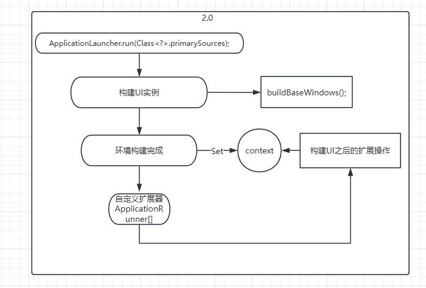
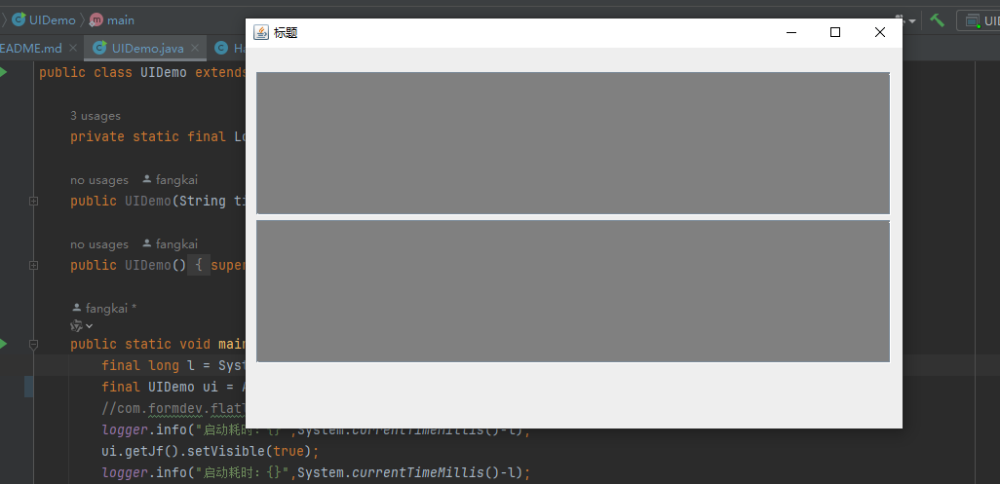
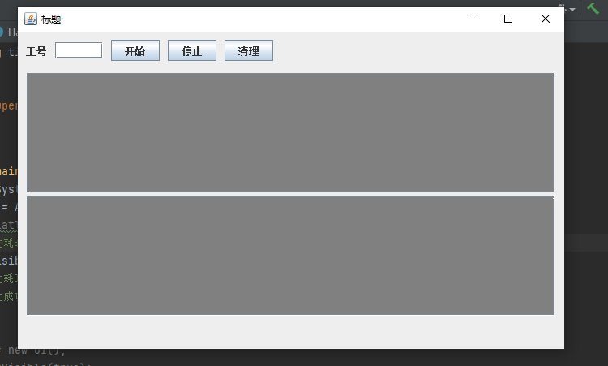

# base-client-ui


-----------
### 1. 项目介绍
一个封装好的java swing开发的快速构建工具，因为长时间使用Spring框架的习惯，支持依赖注入以及程序执行后的一些扩展操作。 
封装了常用控件，方便快速开发，内置了Spring的IOC容器、与程序后置处理器<br/>
pers.yuews.bcu.core.common.annotaion包下存在注解。自动注入、包扫描、自动注册bean、UI组件注册。<br/>
pers.yuews.bcu.core.common.context.EnvironmentContext#getInstance()#get()获取注册的bean。<br/>
启动顺序：<br/>


-----------
### 2. 快速开始

##### 2.1、引入jar包
```xml
<dependency>
    <groupId>pers.yuews</groupId>
    <artifactId>bcu-core</artifactId>
    <version>1.0-SNAPSHOT</version>
    <scope>compile</scope>
</dependency>
```
##### 2.2 编写启动类
1、将启动类继承自pers.yuews.bcu.core.ui.BaseWindows。<br/>
2、添加@ComponentScan注解<br/>
3、重写父类构造器<br/>
4、在main方法中使用 ApplicationLauncher.run(Class<?> primarySources, "标题").getJf().setVisible(true);<br/>


```java
package com.demo;

import pers.yuews.bcu.core.ApplicationLauncher;
import pers.yuews.bcu.core.common.annotaion.ComponentScan;
import pers.yuews.bcu.core.common.enums.MessageTypeEnum;
import pers.yuews.bcu.core.ui.BaseWindows;

/**
 * @author yuews
 * @create 2024/6/6 16:33
 * @describe
 */
@ComponentScan(registerPackagePaths = {"pers.yuews.bcu.demo"},fieldValuePackagePaths={"pers.yuews.bcu.demo"})
public class DemoUI extends BaseWindows {

    public DemoUI(String title) {
        super(title);
    }

    public DemoUI() {
    }

    public static void main(String[] args) {
	    final long l = System.currentTimeMillis();
	    final UIDemo ui = ApplicationLauncher.run(UIDemo.class,"标题");
	    //com.formdev.flatlaf.intellijthemes.materialthemeuilite.FlatGitHubContrastIJTheme.setup();
	    logger.info("启动耗时：{}",System.currentTimeMillis()-l);
	    ui.getJf().setVisible(true);
	    logger.info("启动耗时：{}",System.currentTimeMillis()-l);
	    logger.info("启动成功");
    }


    @Override
    public void pushMsg(String s, MessageTypeEnum messageTypeEnum) {

    }
}

```

### 3.添加组件(按钮、输入框、下拉框等)
##### 3.1 创建事件监听器
新增一个类，实现pers.yuews.bcu.core.common.event.listener.BaseListener,这里事件监听器的逻辑。如按钮被点击的事件、输入框输入事件等。
```java
@Container
public class StarterListener extends BaseListener {

    @Autowired(type = UI.class)
    UI ui;

    @Autowired
    JButton startButton;

    @Override
    public void actionPerformed(ActionEvent e) {
        ui.pushMsg("启动成功", MessageTypeEnum.ROUTINE);
        startButton.setEnabled(false);
    }

    @Override
    public void keyTyped(KeyEvent e) {

    }

    @Override
    public void keyPressed(KeyEvent e) {

    }

    @Override
    public void keyReleased(KeyEvent e) {

    }

}
```
------------

##### 3.2 创建组件处理器
新增一个类，继承pers.yuews.bcu.core.common.handler.BuilderHandler,标记@UIComponent()注解<br/>
组件的逻辑在addComponent()方法中写入，将监听器注入到组件中，并且绑定上事件监听器(3.1的实现类)<br/>
因为组件处理器是责任链模式，所以需要返回下一个组件处理器(必须要使用注入的方式)，若没有下一个组件处理器，则返回null<br/>

```java
@UIComponent(text = "开始",listenerEvent = StarterListener.class)
public class StarterButtonHandler extends BuilderHandler {

    @Container
    final JButton startButton = new JButton();

    @Autowired(type = StarterListener.class)
    StarterListener starterListener;

    @Autowired(type = StopButtonHandler.class)
    StopButtonHandler stopButtonHandler;

    @Override
    protected BuilderHandler addComponent(BuilderHandler successor, JPanel panel,UIComponent annotation ){
        startButton.setText(annotation.text());
        startButton.addActionListener(starterListener);
        panel.add(startButton);
        return stopButtonHandler;
    }
}
```


详情可以参考pers.yuews.bcu.core.demo 包的实现

### 4、扩展实现
##### 4.1 ApplicationRunner扩展
会在启动注入bean、字段后执行，自动扫描主类包路径下，实现ApplicationRunner接口，重写run方法，在run方法中执行业务逻辑。
##### 4.2 构造方法扩展
重写buildUIBefore()、buildUIAfter()即可

